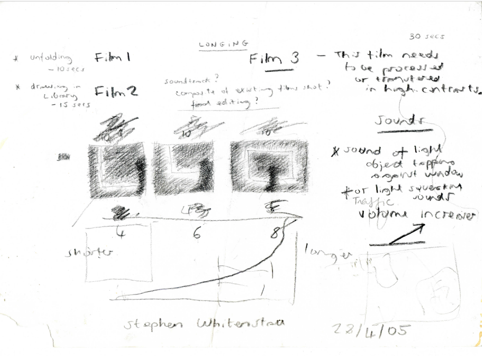

# Artwork

## April 2005

### Forever Blowing Bubbles

#### 28th April 2005

### Whitechapel-Library

### Whitechapel Gallery - Film Plan

## October 2005 

### CapitalA. Visit to the V and A.

#### 25th October 2005 

