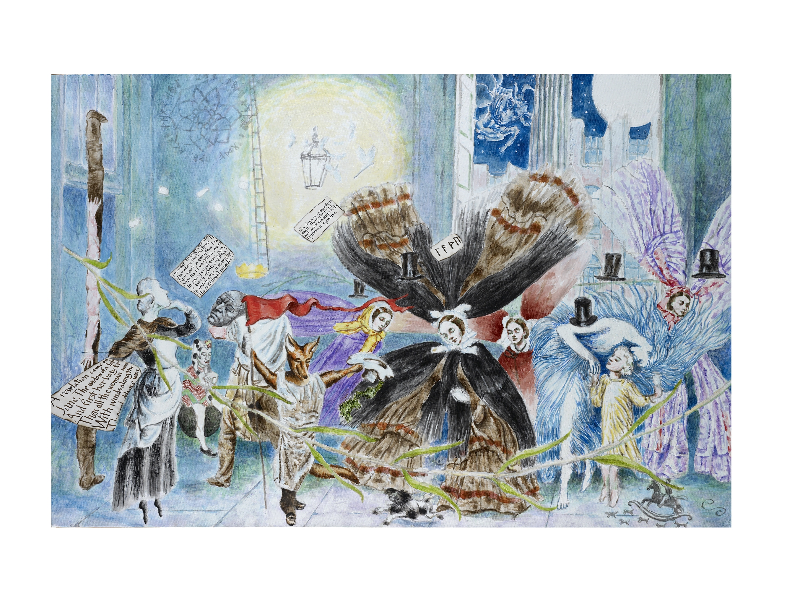

# 2010

## March 2010

### The General Post Office. 

It is one minute to midnight on May Day Eve at the General Post Office.

Taurus the bull is in the sky by a full May moon looking down.

Reynard the fox transformed from an errand boy holds forth, raising his red pennant.

Sweeping through the hall the green willow evokes remembrance of forsaken love but also loyalty in love, for it is Mayday the time of Love.

"All around my hat I will wear the green willow"

A runic invocation awakes the May spirits and causes the sleeping senders of letters to grow wings and flutter like moths through the hall.

To the left "A revelation came on Jane, the widow of a labouring swain and first her body trembled, Then all the woman was .. with winds along the ..." Jane is transfixed by the full moon.

Besides Jane a Postman is transformed into a human totem pole.

Just to the right, beside Jane, in the background, a thoughtful Elf is happy at the news of their awakening.

Further right, Bran the Blessed has returned to London, he may have lost his head, but he has gained the head of William Blake, the true king of England \(with Bran\). A crown floats above Blakes/Brans head.

"Blake quote"

The stiff Victorian gents have vanished, but their Top Hats remain to lend decoration to the night.

To the extreme right the Lady of the North Wind, icy in blue, guides a sleeping child with her wish in a letter.

At the child's feet a rocking horse has come to life, engaged in its own "great hunt", for Odin can be small as well as large.

In the background, a lamp floats over the proceedings and moths \(as to a flame\) flutter. Inscribed faintly on the wall is the Runic alphabet \(Saxon\).

