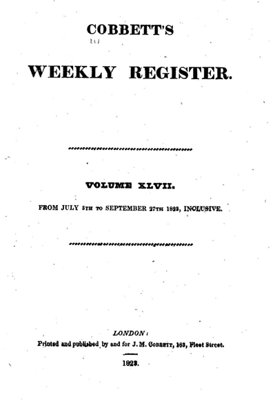
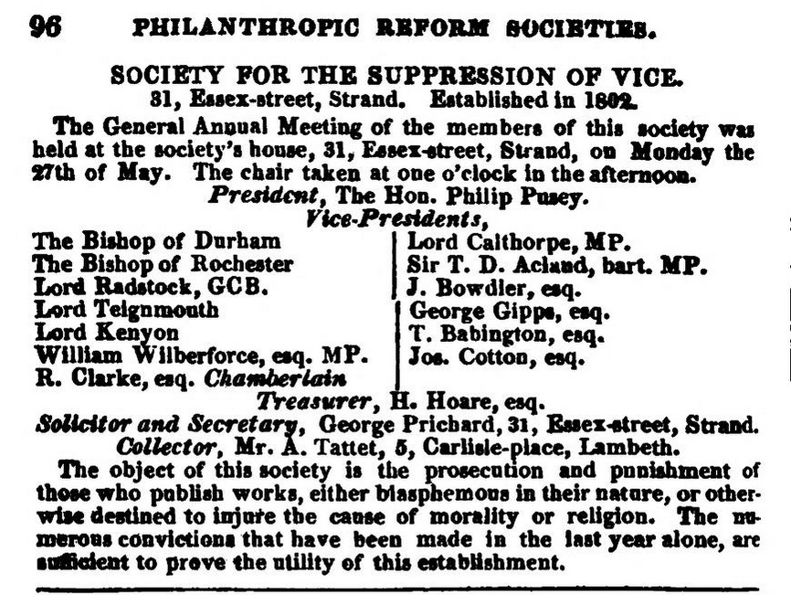

# Writing & Notes from 2011

## October 2011

### Egalitarianism of the Enlightenment  : Enlightenment.

I think the Egalitarianism of the enlightenment's public sphere was limited to those with the resources to access it. Within this sphere free thought was encouraged and opinions could be debated. Those outside it, the majority of people,those who were not 'men of letters', "the blind and noisy multitude", the particular, the local and those who could not reason were excluded. The cohesion of this public sphere began to loosen with increasing literacy, the beginnings of romanticism and the emerging nationalism of figures like Herder.

I agree that groups and clubs can act as springboards for new ideas. However when such groups make claims to universality,authority, representation or education then the context in which their ideas are forged becomes more relevant. This continues today for example with Universities which have internal "public spheres" accessible only to academics and students.

## November 2011

### Approach to Stendhal TMA  : Stendhal.

I like to treat each TMA a bit like a work of detection. The equivalent of 'establishing the motive' is clarifying the question. The first part of the question does not require examples of genius \(exclusively\). It requires an analysis of \index{Stendhal}Stendhal's presentation of Napoleon \(as it is\) and how each paragraph contributes \(or not\) to an overall picture.

Each paragraph presents opportunities for establishing Stendhal's motives \(to use the Detective metaphor\). I suggest 'follow the leads' ! For example, why does he choose Melzi and Merveldt for testimonials, why does he choose the particular time and place for a positive view of Napoleon ? Then ... what do the sources actually do or say outside of Stendhal's presentation ? Is he being selective ?

The second part concerns Stendhal's view of \index{Napoleon}Napoleon as a Genius per se. We are directed to the extract for evidence of this. But also we are given an opportunity to present our 'understanding of Stendhal's book'. Such understanding, in my view, can draw on the wider context of the book within Stendhal's life. How did Stendhal form his ideas ? Did they change over time ? How do they contrast with his contemporaries ?

His Napoleon book is after all, a draft. What did he actually publish on Napoleon in his lifetime \(look it up\). His two most famous novels both use Napoleon as a background. Some suggestions. What did he write about himself ? Why did he use a particular style of writing ? What was his education ?

This of course is just background, 'gathering evidence for the prosecution' \(as it were\). To answer the second part of the question is make a personal judgement on the evidence \(of Napoleon as Genius\). I have found this process very rewarding and interesting. Particularly how Stendhal stands in contrast with his peers. He is more real and human than many other Romantics. But that is just my personal judgement.

### Stendhal on style  : Stendhal.

As a youngster in the 1790s, Stendhal resented his bourgeois fathers pretensions of aristocracy. When they praised the arts, "their praises give me a mortal distaste for the most beautiful things". He felt their praise was "in bad faith". "... verse annoyed me because it dragged the sentences out and made them lose their clarity. I loathed steed instead of horse. I called that hypocrisy". Any thoughts ?

### Stendhal on the English  : Stendhal.

" _... those English are gloomy, commonsensical people; I don't know of any people more talkative and yet more frigid_." Letter to Pauline \(His sister\), July 1804

Of England ..."_...a country administered for the sole benefit and glory of between a thousand and twelve hundred families_." From 'Lord Byron in Italy', 1830

I wonder how far national identity determines a view of Napoleon and is it impossible to write anything objective about him ?

## December 2011

### FT Article : Guilt and Glory, the legacy of Empire 

In the wake of recent political debates about the legacy of the British Empire and how it should be taught in schools, there has been much written in the press about 3 recent books by Jeremy Paxman, Richard Gott and Kwasi Kwarteng on the subject.This FT article does a good job of comparing the books.Not directly relevant to TMA03, but I found it interesting food for thought.

### Physiognomy and Napoleon 

Stendhal refers frequently in; his autobiography to Physiognomy, both literally, as in 'reading faces' and metaphorically as the "physiognomy of events". It seems to be a commonplace of the early 19th century and even a light-hearted pastime.

Napoleon said of Physiognomy : "_we must not judge of a man by his face; we can know him only by his conduct. What countenances have I had to judge in the course of my life! What odd examples of physiognomy have come under my observation!_"

### My perfect good faith - Stendhal 

"I don't believe myself to have any other genius, any other guarantee of my worth, beyond ..

1. to depict a likeness of the nature which at certain moments

   appears

   to me with such clarity;

2. I am confident of my perfect good faith, of my reverence for

   what is

   true;

3. and of the pleasure I take in writing, a pleasure which became a

   mania in 1817 \(in Milan, at M.Peronti's, Corsia del Giardino\)

   Note : 13 pages in an hour and a half. Damnably cold, 3 January

   1836."

### Stendhal, The Life of Henry Brulard, NY Review Books, 1995,p.264, Chapter 24

I thought this gives quite a charming insight into Stendhal's motives. He would forget himself writing and find himself literally in the dark scrambling for candles. Anyway what a relief to finish an essay, Damnably windy !

### BBC Documentary : The Last Explorers : Livingstone 

I found this documentary \(link\) a gentle transition to some of the concerns of TMA03. Livingstone was a Doctor, Scottish and Non-conformist like Mungo Park. Unlike Park he wanted to end slavery through commerce and religious conversion. However his mapping of the interior had the unintended consequence of providing information for more ruthless exploitation later. This documentary is available on BBC iplayer until 22nd December 2011.



### William Cobbett on Wilberforce 

**William Cobbett** raging against **William Wilberforce** in his **Political Register** of July 19th 1823.

"_Wilberforce writes long humbug pamphlets ... about West Indian Slavery._"

"_... special care does he take never to write pamphlets about the wretched people in Ireland_,"

_"When he talks about humanity, it is in favour of somebody at a great distance; somebody that the Government has no interest in oppressing._"

"_For about thirty years Wilberforce has been at work about the blacks. Negro slavery has been rendered threefold more harsh in consequence of his efforts._"

_"The whole of the colonies of America, ...must be completely revolutionised, before his schemes are put into practice. Ages will not see the thing done._"

**Cobbett's Political Register, Volume 47, 1823, p.146**

Google book copy \([link](https://books.google.co.uk/books?id=wpVCAAAAYAAJ&printsec=frontcover#v=onepage&q&f=false)\)

### Article comparing Cobbett and Wilberforce On Peterloo August 30th, 1823

_"But Wilberforce listen to me a bit; did you not hear of a parcel of people, who were assembled at Manchester on 16th August 1819 ? These people whom you call free British labourers.Well then these labourers had not run away from any masters. They committed no crimes or misdemeanours towards any masters. About 500 of them were, nevertheless,killed or wounded: they suffered "in life or member_"."

"_...Did you not object to any parliamentary inquiry into the conduct of those who caused the killing and wounding ? Well then, this was all right, was it ? The killing and wounding at Manchester was right: the thanking of the killers and wounders was right: it was right to applaud the conduct of the Ministers, and to object to the inquiry_." Cobbetts Poltical Register, Volume 47, p.518

Source as above

The context of both tirades is a Bill proposed by Wilberforce to fine slave-owners for mistreatment of their slaves. Cobbett is angered at what he perceives as double standards, he also sees a pattern of moral hypocrisy in Protestantism in general.

### The Society for the suppression of vice 

The society for the suppression of vice

"_The object of this society is the prosecution and punishment of those who publish works, either blasphemous in their nature, or otherwise destined to injure the cause of morality or religion.The numerous convictions that have been made in the last year alone, are sufficient to prove the utility of this establishment_"

Vice-Presidents incl: William Wilberforce

pg.96, The annual subscription charities and public societies in London, 1823, John Murray \([link](https://archive.org/details/annualsubscript00unkngoog/page/n137/mode/2up)\)

A letter to the society for the suppression of vice \(self-styled and by no-one else\). On their prosecution of the editor and his wife ...\(link\) pg.181, The Republican, Feb. 25th 1820, Richard Carlile \(publisher of Tom Paine's The Rights of Man\).

I believe Wilberforce was sincere in his beliefs and can be credited for working tirelessly to abolish the Slave Trade. His record on manumission, involuntary labour \(Sierre Leone\) and the "suppression of vice" is more ambigious. I think it is misleading to just look to Parliament at a time when large urban areas were not represented at all. As for woman's suffrage and rights being "virtually unheard of" that is patently misleading, at least in the 1820s. Look at Anna Wheeler, Frances \(Fanny\) Wright, Eliza Macauley, Frances Morrison and others associated with Robert Owen for example. Unheard of in Parliament certainly, but not in the real world. Abolitionists themselves were accused of Jacobinism in the 1790s. What was at stake for many was the threat to property rights so sacred for mercantile society.

"_Slavery is such an atrocious debasement of human nature, that its very extirpation, if not performed with solicitous care, may sometimes open a source of serious evils._" Benjamin Franklin, An Address to the Public, November 1789

To add some context to the above and to be fair to Wilberforce below is a list of all the organisations he was involved with in 1823 \(in addition to the suppression of vice\). An interesting mix of philanthropy, charity, punishment and censorship.

Source : The annual subscription charities and public societies in London, 1823, John Murray

* London Hiberian Society - establishing schools distributing

  Bibles in Ireland \(Vice-President\) pg.13

* Society for the relief of poor Africans and Asiatics -

  Schools, Bibles, Repatriation \(President\) pg.16

* Seaman's Hospital - \(Vice-President\) pg.24
* Institution for the cure and prevention of contagious diseases in the metropolis - \(Vice-President\) pg.37
* Asylum for the deaf and dumb - Pensions for over 40s - \(Vice-President\) pg.42
* London fever hospital - \(Vice-President\) pg.44
* Society for the support and encouragement of Sunday schools throughout the British Dominions - \(Vice-President\) pg.52
* St Anne's Society School - Charity School \(President\) pg.59
* Irish Society of London - Education of poor Irish in London \(Vice-President\) pg.75
* Society for the suppression of mendacity - regulation of street begging, punishment of vagrants - \(Steward\) pg.95
* Society for the improvement of prison discipline and for the reformation of juvenile offenders - a real live issue in 

  1823 because of a bad youth street gang problem ! - \(Vice-President\) pg.96

* London Female Penitentiary - Bible education leading to domestic service \(Chairman\) pg.102
* Yorkshire Society - noblemen and gentlemen of York- \(Steward\) pg.137
* Society for improving the condition of children and others employed by chimney sweepers - \(Vice-President\) pg.141
* African Institution - Promoting civilisation in Africa, suppressing slavery - \(Vice-President\) pg.142

### The legacy of Isaac Watts 

Comparing the hymns of Addison, Watts and Wesley is very enlightening. I found the OU exercise very helpful in this \(Block 3, pg.20\). I thought I'd share some agnostic impressions and discoveries ...

Addison's "The spacious firmament on high" \(Anthology I, p.229\), full of order and reason seems incongruous in a spiritual song. It is clear to see how such a line of thought leads to deism.

Wesley's "And can it be ...?" \(Anthology I, p.233\) suggests an almost proprietorial personal investment in religion. The achievement of a personal interest is almost Faustian !

Watt's "When I survey the won'drous Cross" \(Anthology I, p.230\) feels the most genuine, it is simple and straightforward. Not surprising given it is about self-effacement.

I've encountered Isaac Watts before in reading his 'The improvement of the mind' \(1741\) a clear-sighted work with common- sense tips to study. Puts a lot of modern self-help books to shame ! His 'Logic' \(1724\) is a beginners textbook influenced by John Locke.

William Blake's 'Songs of Innocence and Experience' was influenced by Watt's 'Divine Songs' . An article 'Isaac Watts and William Blake' \(Review of English Studies, Jul 1944\) can be found searching the OU library. In addition Watt's Psalms and the way his hymns were 'lined out' contributed to the composition of some Negro spirituals \( see 'Psalms in the Key of Life Isaac Watts and the Composers of Negro Spirituals', King or 'Dr. Watts and Mahalia Jackson - The Development, Decline, and Survival of a Folk Style in America', Tallmadge\). There is much speculation that some of his hymns were a direct inspiration for some spirituals. Such as 'When Israel Freed From Pharaoh's Land' as an influence for 'Go Down Moses'. There are some wonderful performances of spirituals on YouTube from the likes of Mahalia Jackson, Marion Anderson, Paul Robeson and Roland Hayes. Note : In the Baptist churches of Southern America "at the beginning of service the deacons will stand up front in a circle or in a couple of lines and the leader will start speaking a scripture or a line from a hymn and then all the deacons will take it up as a long long drawn out moaning chant, usually harmonised rather than in unison" \(Les Forgue\) Add. I think "...the little busy bee" is from his Divine Songs sometimes entitled \(rather sternly\) 'Against Idleness and Mischief' in Victorian Anthologies. I guess Watts would be prime target for mischief by Rev. Dodgson. Also compare Blake's London ... "I wander thro' each charter'd street, Near where the charter'd Thames does flow, And mark in every face I meet Marks of weekness, marks of woe." To Watt's Divine Song IV ... "Whene'er I take my walks abroad, How many poor I see, What shall I render to my God For all his gifts to me ?" Blakes rages against the "mind-forg'd manacles" while Watts draws a moral lesson.

### The 'cemetery of the new blacks' 



A new, fascinating and poignant Guardian article on tooth analysis \(Using strontium isotope analyses of tooth enamel\) from a mass grave of Slaves in Rio has revealed a wide geographical area from which Africans were taken in the Portuguese slave trade. \(link\) Sugar production shifted to Brazil and Cuba around 1800 from the West Indies. Another article from 2005 \(link\) describes the discovery of the grave and reflects on the continuing legacy in the favela of Providencia. "The favela, founded in 1897 by homeless soldiers and freed slaves, towers over Gamboa's mass grave and is bisected by a towering staircase built by slaves."

### Early Abolitionism : Quakers 

Notes on [David Brion Davies](https://en.wikipedia.org/wiki/David_Brion_Davis)'s _Quakers and the Sectarian Tradition, Slavery in Western Culture_, OUP, 1966

_"Since sin was traditionally thought as a kind of slavery, and external bondage was justified as a product of sin, any change in the meaning of sin would be likely to affect attitudes to slavery._" Davis, 1966, Pg.292, Quakers and the Sectarian Tradition, Slavery in Western Culture, OUP

"_When changing social and economic conditions brought a convergence of millennialism, perfectionism, and primitivism, the entire social order was seen to be based on a principle of slavery_." Ibid. pg.299

"_Barclay did place the inward testimony of the Spirit above the authority of Scripture, reason, or external law, and thus tended to undermine the traditional foundations of social discipline_." Ibid. pg.301

This passage refers to Robert Barclay's 'An Apology for the True Christian Divinity: Being an Explanation and Vindication of the Principles and Doctrines of the People called Quakers' \(1678\). Barclay approved of personal responsibility but not the "wild notions" of those of the Munster Anabaptists who would "seek to make all things common, and would force their neighbours to share their estates with them.". Ibid. Summary of pg.302

The Quakers developed a peculiar culture of perfectionist self-questioning for the individual twinned with a concern for maintaining a group consensus. Quakers who went too far in their condemnation of slavery were disowned by the community. Yet this did not prevent periodic exclamations of conscience from the likes of Elihu Coleman and William Edmundson 'who held that perpetual bondage was an "oppression of the mind"' \(see. Ibid. pg.307\).

Quakers were also intimately linked with the early expansion of sugar cultivation and the African trade. \(ibid. pg.303\) Spiritual conscience conflicted with commercial exploitation.

### Stendhal and Napoleon 

Stendhal admires Constant's work on Tyranny \(source 'Letters to Pauline'\) and has some sympathy for De Stael's camp. As he refutes her 'slander' the essence of what the 'great soul' effected is revealed; it is the hopes and dreams of the detested and outcast.

Stendhal at one point denies Napoleon's Machiavellian and at another suggests it; when does naivety become arrogance ? Stendhal also regrets the loss of passion that existed after Napoleon's time, how people stood out and then hid away.

Stendhal's life of Napoleon at times resembles an internal dialogue. Napoleon slips from his fingers; as though the Napoleon he imagines does not exist \(like the satirical work that also suggested the non-existence of Napoleon\).

Then again Napoleon exists in the minds of men, a mirror of their desires and wishes. Stendhal is Napoleon. Is his love of Napoleon also an /amour propre/, a self-love. Stendhal 'falls with Napoleon' and he follows his feelings.

So intense that the happiest moments Stendhal cannot express - as at the end of his 'Life of Henry Brulard' after he crosses the Alps at Saint Bernard.

Stendhal is undecided. His life of Napoleon is an internal dialogue, or perhaps a test of his thinking. He leaves the manuscript behind in Italy.

