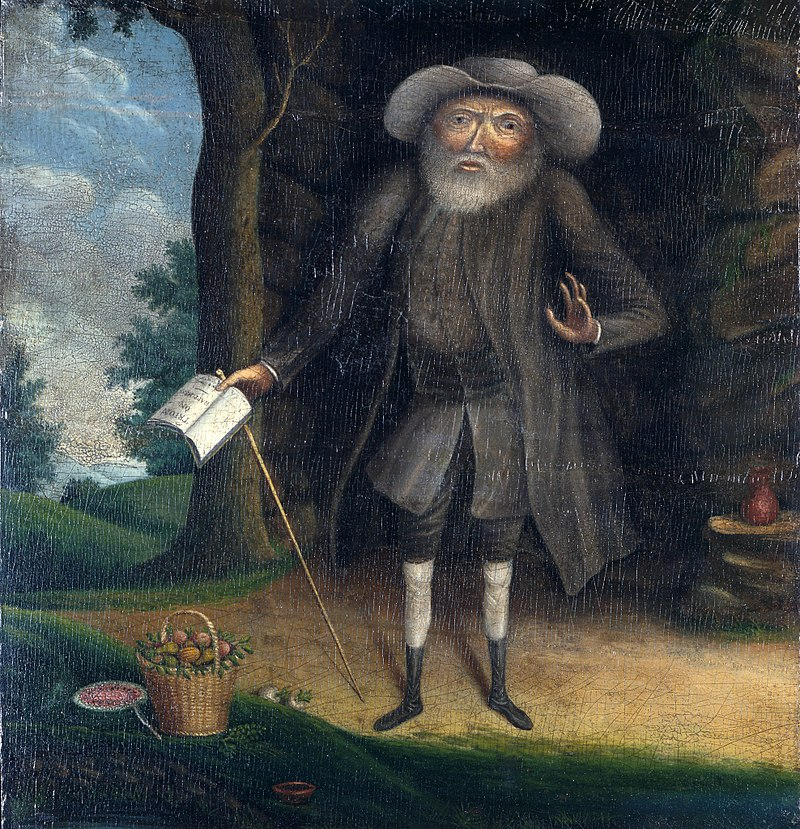
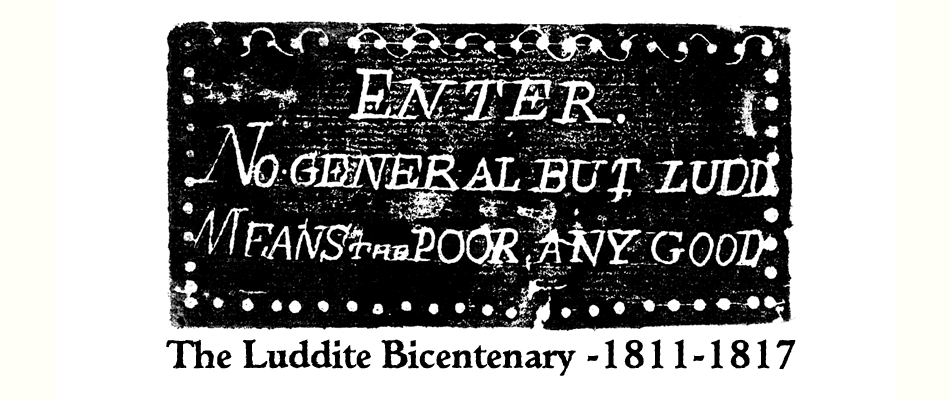
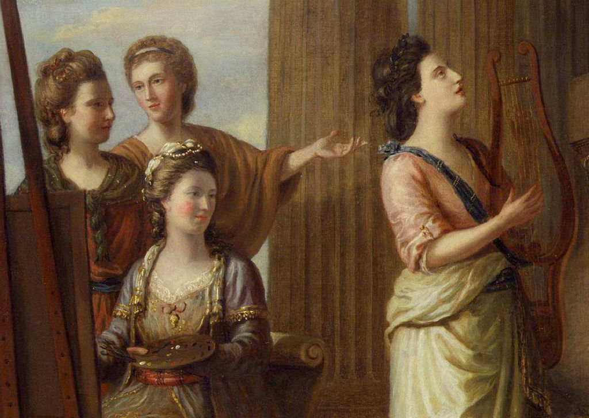
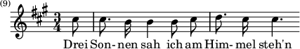

# Writing & Notes from 2012

## January 2012

### Early Abolitionism : Quakers II 

The Catholic Church issued bulls against 'unjust' forms of slavery in the 16th century. In the 17th century Jesuits forced an answer from the Inquisition \(1686\) on the morality of slave holding. The response stated that Slaveholders were obliged to free those 'unjustly enslaved'. However real organised moral questioning came at first from the Quakers. The Quakers developed a peculiar culture of perfectionist self-questioning for the individual twinned with a concern for maintaining a group consensus. At first individual Quakers who went too far in their condemnation of slavery were disowned by the community. Yet this did not prevent periodic exclamations of conscience from the likes of Elihu Coleman and William Edmundson 'who held that perpetual bondage was an "oppression of the mind"' . Quakers were also intimately linked with the early expansion of sugar cultivation and the African trade. Spiritual conscience conflicted with commercial exploitation.

In the 1730s the eccentric Quaker \index{Benjamin Lay}Benjamin Lay's 'All Slaveholders Apostates' \(Published by the way by Benjamin Franklin\) began to nudge the Quakers consciences further. Finally in 1757 the London Yearly Meeting of Quakers began the international process of prohibiting Quaker involvement in Slavery. Philadelphia followed in 1758 and New England in 1760. \(See David Brion Davies's 'The Problem of Slavery in Western Culture', Chapter 10 Quakers and the Sectarian Tradition, OUP, 1966 for more details.\) So the moral problem was addressed by some prior to the evangelicals, albeit in a localised way. The Papal Bull referred to is the Sublimus Dei of 1537 and was reactive in following the Spanish King's prohibition of enslaving 'Indians' \(Native Americans\). The Jesuits in question were of the so-called Jesuit Reductions, self-contained 'Indian' \(Native American\) communities organised and led by Jesuits. These communities occurred in parts of what is now Paraguay, Argentina, Brazil and Bolivia. The Jesuits armed their 'Indian' communities against slave-trading pirates and sought theological justification from the Inquisition \(1686\). I came across these examples in a preamble somewhere, however as they are highly localised they do not bear much on the development of a unified moral opposition to Slavery, in my view. The Catholic Church \(and indeed established Protestant Churches\) continued to justify slavery on the 'man's place in the universe' argument well into the 18th century. The Quakers do demand particular note because they were the first Western community to "abolish" slavery. They also represent that non-conformist shift from 'Obedience to Church authority' to obeying 'inward testimony' \(or conscience\). The nature of the Quaker community is interesting too, where each member speaks their testimony to God at meetings and where a spiritual consensus is sought. This meant once one Quaker meeting condemned Slavery they were all required to. Ironically the arguments of many Rationalist Enlightenment thinkers could be \(and were\) used to justify Slavery. The great moral weakness of the Rational Enlightenment is also one of its strengths ... the questioning of a supreme moral authority. Christian reformers had the advantage of moral certainty based on the absolute authority of God \(speaking through conscience\) however retrograde that might be.

I think this is more 'background' for the essay rather than directly relevant. I suppose what is at issue is what was Mungo Park's world view ? The trans-atlantic trade seems to me more straightforward to condemn, because it was within the West's moral compass and control. Slavery within Africa is ambiguous, there is a danger of projecting 'our' moral standards onto the issue. History, in my view, is not consistent morally.

### The eccentric Benjamin Lay 

This is a précis of David Brion Davis's account of Benjamin Lay from 'The problem of Slavery in Western Culture', pgs. 321-325, OUP, 1966. I had never heard of this character before and thought I'd share this summary. Benjamin Lay was born a hunchback to poor Quaker parents in Colchester circa 1681. They 'bound him out' to a glovemaker, but he shortly became a sailor \(1710\). He witnessed the 'relative mildness' of 'Moslem' slavery in Turkey and compared this to the cruelty of his shipmates tales of the African Trade. He returned to England and married a hunchbacked woman called Sarah. He incited 'public disturbances' at Quaker meetings in England and also disrupted Baptist and Presbyterian services. When he decided to emigrate to America the relieved Colchester Quakers issued him a membership certificate to present at Philadelphia. However this was withdrawn before he left for his "contentious conduct" !

Benjamin and Sarah Lay briefly stopped over in Barbados where they ran a food store. Here they witnessed the desperation of 'starving Negroes' rushing for the garbage Sarah threw in the street. After witnessing the public torture of an escaped Slave \(hanging in front of a Quaker House\) the cruelties of Barbados became too much for them. Upon arrival in Philadelphia the Lays found 'that even there the evil had taken root'. Lay despised polite addresses, once when addressed as "your humble servant" he retorted "... if thou are my humble servant, clean my shoes". He insisted on only travelling by foot, wore home-made clothes and was a strict vegetarian. He once made a public exhibition of smashing Sarah's tea cups to protest the use of sugar, this resulted in the crowd " running off with much of their china". "He went to Quaker meeting clothed in sackcloth, denounced the wealthy slave masters. In winter he sat outside a meetinghouse ... bare in the snow ... when people expressed concern ... he asked them why they were blind to the sufferings of their scantily clad Negroes. When ejected from a meetinghouse, he lay in front of the door in the rain and made the congregation step over his body. He supposedly kidnapped the child of a slave owner, in order to show the father ...how it felt to have a child taken away. " \(p.323-324, Davies, 1966\) After Sarah's death in 1735 Benjamin became "increasingly isolated" and "lived in a cave like dwelling in country, cultivating his garden and writing tracts against slavery ..." His most famous work 'All Slave-Keepers Apostates' completely lacked any order when Lay gave it to the publisher Benjamin Franklin. Franklin pointed this out and Lay replied that he could "print the pages in any order he chose.". Benjamin Lay who described himself as "a poor common Sailor, and an illiterate Man" died in 1760.

### Bicentenary of the Luddites 

> "_By the Framework knitters A Declaration. Whereas by the charter granted by our late sovereign Lord Charles II by the Grace of God King of Great Britain France and Ireland, the framework knitters are empowered to break and destroy all frames and engines that fabricate articles in a fraudulent and deceitful manner and to destroy all framework knitters' goods whatsoever that are so made ... Given under my hand this first day of January 1812. God protect the Trade. Ned Lud's Office Sherwood Forest_" Source : \(link\) :Labour and Social Protest, Aspects of the Industrial Revolution in Britain, University of Massachusetts Dartmouth.

I noticed it is 200 years since the Luddites began their protests in Nottingham \(starting in November 1811\). They were also protesting against the 'Combination Act of 1800' \(link\) "An Act to prevent Unlawful Combinations of Workmen". In March 1812, machine breaking was made a capital crime when the 'Destruction of Stocking Frames Act, etc' \(link\) was passed in Parliament. This resulted in executions and transportations of Luddites. "As the Liberty lads o'er the sea Bought their freedom, and cheaply, with blood, So we, boys, we Will die fighting, or live free, And down with all kings but King Ludd! When the web that we weave is complete, And the shuttle exchanged for the sword, We will fling the winding sheet O'er the despot at our feet, And dye it deep in the gore he has pour'd. Though black as his heart its hue, Since his veins are corrupted to mud, Yet this is the dew Which the tree shall renew Of Liberty, planted by Ludd!" Lord Byron, "Song for the Luddites" \(December 1816\) I was rather bemused by the inequality of anniversaries. In 1981, on the 600th anniversary of the Peasants revolt, the then Archbishop of Canterbury Robert Runcie declared that the church should have no involvement with it. Also how 'Luddite' has become a term of abuse, an appellation to be stuck on ignorant fools afraid of innovation. Yet Technology always has two sides, the side it enables and the side it excludes or exploits. Although sometimes this is surprising, as in the use of 'smartphones' in last years 'maghreb' revolutions. The Luddites were highly organised. The Annual Register for 1812 reported the movement had "a character of daring and ferocity, unprecendented among the lower classes in this country." They were also well armed with hatchets and "Enoch" hammers \(Large Blacksmith hammers\). They were sometimes supported by the Local Press. "And night by night when all is still And the moon is hid behind the hill, We forward march to do our will With hatchet, pike and gun ! Oh the cropper lads for me, the gallant lads for me, Who with lusty stroke The shear frames broke, The cropper lads for me !" 'Shear's Inn Song' quoted in p.10, 'Rebels against the Future, The Luddites and their war on the Industrial Revolution', Kirkpatrick Sale, 1996 ... and the bicentenary is being marked. There is an excellent blog recording events day by day at \[[http://ludditebicentenary.blogspot.com/](http://ludditebicentenary.blogspot.com/)\] . This site includes an Events section listing upcoming talks and lectures \(mostly Nottingham, Huddersfield\).

### William Gilpin - On the equality of stations 

In his 'Dialogues on various subjects' \(1807\) the Rev. Gilpin gives a salutary lesson on the common man keeping to his station in life. He does this anecdotally in the picturesque figure of John Mitchel a 'respectable day labourer' whose uncle had taught him to read and 'left him a few books'. John was a very industrious fellow. Then one day "one Thomas Payne" produced his Rights of Man an "artful book ... written with no foundation of reason or argument". This book was explicitly directed "to the common people" and "by infusing notions of inequality" caused "a general discontent". John Mitchel had a friend in a Doctor Lucas who would lend him "chiefly religious books" and "explain passages to him". The Doctor "had some reason to suspect, that Tom Payne's book had made some impression on John". John assured the Doctor that "he never wished to have a hand in any disturbances" and a dialogue ensued between them.

John "thought it hard, that one half of the world should ride on the backs of the other half". The Doctor helpfully explained that not being able to account for great differences in the world is no reason to doubt that they are "permitted by God Almighty". John "allowed this to be true", but thought there a difference between "God's work and man's work". "Government implies difference of station" replied the Doctor and "government is derived from God, so of course different stations also are derived from God". "The rich are ordered to give plenteously - the poor are instructed ... therewith to be content." John saw this very clearly \(apparently\). Yet he wondered why God gave "one man so much more the means of happiness". The Doctor explained that there was unhappiness in all stations of life. "Distress arising from mere want is seldom felt by the virtuous and industrious" the Doctor added. The Doctor went on to list the terrible worries and responsibilities of the wealthy in such detail as to be tedious here. While \(strangely\) even a moderate fortune might tempt John away from the industry of the poor to idleness. The worthy Doctor continued on at some length justifying the status quo. Naturally the conclusion was that the Doctor finally "called for a glass of ale, in which they drank the King's health ! and John went home, quite happy with his situation, as a day labourer." Source: William Gilpin \(1807\), Dialogues on various subjects, 'On equality of stations'. Google ebook \(link\). Apologies for my poor summary. My intention is to demonstrate the mindset of Gilpin and how the picturesque requires a certain patronage of the rural poor. It is also interesting to note the similarities with Robert Owen. Giplin patronises from a patriarchal Anglican tradition whilst Owen patronises from a new entrepreneurial position. Also both Gilpin and Owen stress the good and bad effects of education. Both are concerned with efficient industry in different contexts. My opinion ? The picturesque is an indulgent and exclusive luxury, it may require untended land and the arrangement or airbrushing of day labourers. It is the aesthetic of escape from the new industrial reality for the privileged few.

### The 'mystery' of abolitionism 

I think part of the 'mystery' of abolitionism is that its history is not one of smooth moral progress or even awakening. There are many abolitionist perspectives if you will. However there are broad themes. Personally I think the dominant one, at first, was the 'reformed' religious impulse. The development of 'personal responsibility' in Belief this led to a real fear amongst people that their actions could 'damn them'. It led to a developing examination of what would become 'personal conscience'. Another impulse was the intellectual one, particularly from John Locke onwards, the discussion of 'absolute rights' and so on. Perhaps the Enlightenment created intellectual freedom with moral ambiguity while the Non-conformists created moral responsibility with intellectual ambiguity ? Also there was the peculiar development of 'taste' or the 'man of feeling'. It became fashionable to have sentiment and sympathise with the plight of others. I think actual Abolition only occurred when these separate currents started to come together.

Mungo Park found different 'cultures' of slavery and attempted to rationalise them from his own \(or his editors\) perspective. I like to keep in mind the Enlightenment trick of imagining the reverse. How would a Moslem explorer rationalise the 'cultures' of slavery in the West ? It took decades for the Quakers to finally, as a group, censor Slavery. The causes of the 'moral groundswell' , in general, invite speculation. Is this evidence of the development of a 'modern' public opinion ? Perhaps. A deeper question seems to be an Existential one. In Philosophical terms 'are there moral constants or truths' and 'are they innate to each individual'. There are of course many answers to those questions. Kant in 'Groundwork of the Metaphysic of Morals' \(1785\) tentatively approaches moral absolutes in opposition to Empiricist moral relativism. His contrast between 'price' and 'dignity' has clear implications in the context of Slavery ... "Everything has either a price or a dignity. Whatever has a price can be replaced by something else as its equivalent; on the other hand, whatever is above all price, and therefore admits of no equivalent, has a dignity. But that which constitutes the condition under which alone something can be an end in itself does not have mere relative worth."

## February 2012

### The Beautiful and the Sublime \(Draft\) 

The OU materials focus very much on the Beautiful and the Sublime as aesthetic ideas and much subsequent discussion has focused on this aspect. However there is another element to the Beautiful and the sublime which I feel is lacking from the OU presentation. That is the Beautiful and the Sublime as emerging ideas of psychology and philosophy. This progression is hinted at in Unit 16 \(pgs 20-23\) but not carried forward to, particularly, the philosophical debates of Schiller and Kant. A lot of the sense of the Beautiful and the Sublime as psychological tendencies has been obscured by our modern view of the mind. Particularly the influence of Freud and later of Psychiatry. Indeed the very word psychology is modern. We also tend to associate the Beautiful and the Sublime with new meanings dominated by Aesthetic associations.

The Beautiful and the Sublime from the 18th century perspective are elements and interpretations of sensation \(how we think and feel\). They also figure as outcomes of an education of feeling and therefore have different degrees of meaning according to Class \(position in society\) and Sex \(male/female sensibilities\). In modern terms the Beautiful and the Sublime are characteristics of how the mind responds to and how aware it is of phenomena. These types of sensation have a moral aspect in the 18th century. They are related to how a person should think and feel about things \(a proper sensibility\). They also become a measure of how civilised an individual or a culture is.

One of the first 18th century figures to present a 'psychology' of the sublime was John Dennis \(1657-1734\) . Dennis imagined "a discord" of the "faculties of the Soul" based upon an internal conflict between "the Passions and senses, and of Reason". The sublime, for Dennis, is a passion that restores "the Harmony of the intellectual powers and Animal Powers". Significantly Dennis stated "the more powerful the Reason is, the stronger will be the Passions" implying that the sublime is an outlet for sensations of superior Reason.

Edmund Burke's 'A Philosophical Enquiry into the Origin of Our Ideas of the Sublime and Beautiful' \(1757\) was reviewed and popularised in German in 1758 by Moses Mendelssohn \(Grandfather of the composer Felix Mendelssohn\). Immanuel Kant was a 'Magister' of Rhetoric at the University of Königsberg in the 1760s. He spent most of his time teaching and preparing lectures which were very popular and successful with the students \(such as Herder\).

### Anna Laetitia Barbauld \(1743-1825\) 

_Detail from Nine Living Muses of Great Britain by Richard Samuel \(1779\), from left: Elizabeth Carter, Barbauld gesturing, Angelica Kauffmann, Elizabeth Linley_

Her poem 1811 is fascinating, imaging the passing of England and the future rise of America.

Reading

> "_Where wanders Fancy down the lapse of years Shedding o'er imaged woes untimely tears? Fond moody Power! as hopes as fears prevail,_"

it is an interesting contrast with Childe Harold. Also reminds me of After London by Richard Jefferies and 'The Last Man' by Mary Shelley.

Even premonitions of TS Eliot ...

Compare :

> "_But who their mingled feelings shall pursue When London's faded glories rise to view? The mighty city, which by every road, In floods of people poured itself abroad_;"

with :

> "_Unreal City, Under the brown fog of a winter dawn, A crowd flowed over London Bridge, so many, I had not thought death had undone so many._"

## March 2012

### Die Nebensonnen 

> _I saw three suns in the sky, I stared at them long and hard; And  they, too, stood staring As if unwilling to leave me._

> _Ah, but you are not my suns! Stare at others in the face, then: Until recently I, too, had three; Now the best two are gone. But let the third one go, too! In the darkness I will fare better._

Die Nebensonnen, the penultimate song of winterreise serves to impress triadic associations on the listener. That these associations may be suggestive yet elusive is perhaps the point. Fundamentally the Die Nebensonnen are like a child’s stick figure drawing or Da Vinci’s Vitruvian Man. 

Die Nebensonnen are stick-pins to hold a picture of reality or of self-identity. The figural and symbolic identity of Die Nebensonnen breaks down in the Song from Three Suns to one Sun to none. The scientific fact of the ‘Dog Suns’, a mere optical illusion of Nebensonnen is a reminder that our perception, however flawed, creates meaning in patterns. The Suns stare back at the observer and seem unwilling to leave. 

The triadic symbol is resistant to change, it perhaps is a mere reflection/mirror image of the observer or an imagined deity/after image. Yet the Suns are not the observers suns, at least the observer disowns them. The two best Suns are perhaps the Suns that create meanings, alternatives and relationships. The one Sun is like the pronoun I’, the two other Suns lend meaning, they add verbs and nouns. To query what the trinity represents leads the listener on a journey, their own winterreise. 

To speculate on its meaning is to be complicit in the wanderers illusion. ‘Reality’ is one Sun, we are alone. Figuratively we are left with a geometrical point with no extent or dimension of meaning. To let go of this Sun is to enter darkness. 

A characteristic of Romanticism is the emergence of or emphasis on ambiguous symbolism in contrast to the contained symbolism of the Enlightenment and Renaissance. This open symbolism promises the infinite, rebels against finite restrictions on meaning, but risks becoming meaningless.

