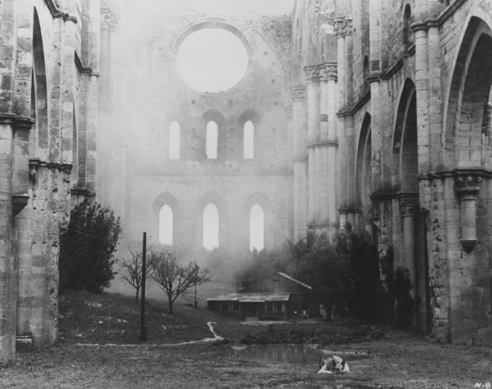

# Writing & Notes from 2012

## January 2012

### Early Abolitionism : Quakers II

The Catholic Church issued bulls against 'unjust' forms of slavery in the 16th century. In the 17th century Jesuits forced an answer from the Inquisition \(1686\) on the morality of slave holding. The response stated that Slaveholders were obliged to free those 'unjustly enslaved'. However real organised moral questioning came at first from the Quakers. The Quakers developed a peculiar culture of perfectionist self-questioning for the individual twinned with a concern for maintaining a group consensus. At first individual Quakers who went too far in their condemnation of slavery were disowned by the community. Yet this did not prevent periodic exclamations of conscience from the likes of Elihu Coleman and William Edmundson 'who held that perpetual bondage was an "oppression of the mind"' . Quakers were also intimately linked with the early expansion of sugar cultivation and the African trade. Spiritual conscience conflicted with commercial exploitation.

In the 1730s the eccentric Quaker \index{Benjamin Lay}Benjamin Lay's 'All Slaveholders Apostates' \(Published by the way by Benjamin Franklin\) began to nudge the Quakers consciences further. Finally in 1757 the London Yearly Meeting of Quakers began the international process of prohibiting Quaker involvement in Slavery. Philadelphia followed in 1758 and New England in 1760. \(See David Brion Davies's 'The Problem of Slavery in Western Culture', Chapter 10 Quakers and the Sectarian Tradition, OUP, 1966 for more details.\) So the moral problem was addressed by some prior to the evangelicals, albeit in a localised way. The Papal Bull referred to is the Sublimus Dei of 1537 and was reactive in following the Spanish King's prohibition of enslaving 'Indians' \(Native Americans\). The Jesuits in question were of the so-called Jesuit Reductions, self-contained 'Indian' \(Native American\) communities organised and led by Jesuits. These communities occurred in parts of what is now Paraguay, Argentina, Brazil and Bolivia. The Jesuits armed their 'Indian' communities against slave-trading pirates and sought theological justification from the Inquisition \(1686\). I came across these examples in a preamble somewhere, however as they are highly localised they do not bear much on the development of a unified moral opposition to Slavery, in my view. The Catholic Church \(and indeed established Protestant Churches\) continued to justify slavery on the 'man's place in the universe' argument well into the 18th century. The Quakers do demand particular note because they were the first Western community to "abolish" slavery. They also represent that non-conformist shift from 'Obedience to Church authority' to obeying 'inward testimony' \(or conscience\). The nature of the Quaker community is interesting too, where each member speaks their testimony to God at meetings and where a spiritual consensus is sought. This meant once one Quaker meeting condemned Slavery they were all required to. Ironically the arguments of many Rationalist Enlightenment thinkers could be \(and were\) used to justify Slavery. The great moral weakness of the Rational Enlightenment is also one of its strengths ... the questioning of a supreme moral authority. Christian reformers had the advantage of moral certainty based on the absolute authority of God \(speaking through conscience\) however retrograde that might be.

I think this is more 'background' for the essay rather than directly relevant. I suppose what is at issue is what was Mungo Park's world view ? The trans-atlantic trade seems to me more straightforward to condemn, because it was within the West's moral compass and control. Slavery within Africa is ambiguous, there is a danger of projecting 'our' moral standards onto the issue. History, in my view, is not consistent morally.

### The eccentric Benjamin Lay

This is a précis of David Brion Davis's account of Benjamin Lay from 'The problem of Slavery in Western Culture', pgs. 321-325, OUP, 1966. I had never heard of this character before and thought I'd share this summary. Benjamin Lay was born a hunchback to poor Quaker parents in Colchester circa 1681. They 'bound him out' to a glovemaker, but he shortly became a sailor \(1710\). He witnessed the 'relative mildness' of 'Moslem' slavery in Turkey and compared this to the cruelty of his shipmates tales of the African Trade. He returned to England and married a hunchbacked woman called Sarah. He incited 'public disturbances' at Quaker meetings in England and also disrupted Baptist and Presbyterian services. When he decided to emigrate to America the relieved Colchester Quakers issued him a membership certificate to present at Philadelphia. However this was withdrawn before he left for his "contentious conduct" !

Benjamin and Sarah Lay briefly stopped over in Barbados where they ran a food store. Here they witnessed the desperation of 'starving Negroes' rushing for the garbage Sarah threw in the street. After witnessing the public torture of an escaped Slave \(hanging in front of a Quaker House\) the cruelties of Barbados became too much for them. Upon arrival in Philadelphia the Lays found 'that even there the evil had taken root'. Lay despised polite addresses, once when addressed as "your humble servant" he retorted "... if thou are my humble servant, clean my shoes". He insisted on only travelling by foot, wore home-made clothes and was a strict vegetarian. He once made a public exhibition of smashing Sarah's tea cups to protest the use of sugar, this resulted in the crowd " running off with much of their china". "He went to Quaker meeting clothed in sackcloth, denounced the wealthy slave masters. In winter he sat outside a meetinghouse ... bare in the snow ... when people expressed concern ... he asked them why they were blind to the sufferings of their scantily clad Negroes. When ejected from a meetinghouse, he lay in front of the door in the rain and made the congregation step over his body. He supposedly kidnapped the child of a slave owner, in order to show the father ...how it felt to have a child taken away. " \(p.323-324, Davies, 1966\) After Sarah's death in 1735 Benjamin became "increasingly isolated" and "lived in a cave like dwelling in country, cultivating his garden and writing tracts against slavery ..." His most famous work 'All Slave-Keepers Apostates' completely lacked any order when Lay gave it to the publisher Benjamin Franklin. Franklin pointed this out and Lay replied that he could "print the pages in any order he chose.". Benjamin Lay who described himself as "a poor common Sailor, and an illiterate Man" died in 1760.

### Bicentenary of the Luddites

> "_By the Framework knitters A Declaration. Whereas by the charter granted by our late sovereign Lord Charles II by the Grace of God King of Great Britain France and Ireland, the framework knitters are empowered to break and destroy all frames and engines that fabricate articles in a fraudulent and deceitful manner and to destroy all framework knitters' goods whatsoever that are so made ... Given under my hand this first day of January 1812. God protect the Trade. Ned Lud's Office Sherwood Forest_" Source : \(link\) :Labour and Social Protest, Aspects of the Industrial Revolution in Britain, University of Massachusetts Dartmouth.

I noticed it is 200 years since the Luddites began their protests in Nottingham \(starting in November 1811\). They were also protesting against the 'Combination Act of 1800' \(link\) "An Act to prevent Unlawful Combinations of Workmen". In March 1812, machine breaking was made a capital crime when the 'Destruction of Stocking Frames Act, etc' \(link\) was passed in Parliament. This resulted in executions and transportations of Luddites. "As the Liberty lads o'er the sea Bought their freedom, and cheaply, with blood, So we, boys, we Will die fighting, or live free, And down with all kings but King Ludd! When the web that we weave is complete, And the shuttle exchanged for the sword, We will fling the winding sheet O'er the despot at our feet, And dye it deep in the gore he has pour'd. Though black as his heart its hue, Since his veins are corrupted to mud, Yet this is the dew Which the tree shall renew Of Liberty, planted by Ludd!" Lord Byron, "Song for the Luddites" \(December 1816\) I was rather bemused by the inequality of anniversaries. In 1981, on the 600th anniversary of the Peasants revolt, the then Archbishop of Canterbury Robert Runcie declared that the church should have no involvement with it. Also how 'Luddite' has become a term of abuse, an appellation to be stuck on ignorant fools afraid of innovation. Yet Technology always has two sides, the side it enables and the side it excludes or exploits. Although sometimes this is surprising, as in the use of 'smartphones' in last years 'maghreb' revolutions. The Luddites were highly organised. The Annual Register for 1812 reported the movement had "a character of daring and ferocity, unprecendented among the lower classes in this country." They were also well armed with hatchets and "Enoch" hammers \(Large Blacksmith hammers\). They were sometimes supported by the Local Press. "And night by night when all is still And the moon is hid behind the hill, We forward march to do our will With hatchet, pike and gun ! Oh the cropper lads for me, the gallant lads for me, Who with lusty stroke The shear frames broke, The cropper lads for me !" 'Shear's Inn Song' quoted in p.10, 'Rebels against the Future, The Luddites and their war on the Industrial Revolution', Kirkpatrick Sale, 1996 ... and the bicentenary is being marked. There is an excellent blog recording events day by day at \[[http://ludditebicentenary.blogspot.com/](http://ludditebicentenary.blogspot.com/)\] . This site includes an Events section listing upcoming talks and lectures \(mostly Nottingham, Huddersfield\).

### William Gilpin - On the equality of stations

In his 'Dialogues on various subjects' \(1807\) the Rev. Gilpin gives a salutary lesson on the common man keeping to his station in life. He does this anecdotally in the picturesque figure of John Mitchel a 'respectable day labourer' whose uncle had taught him to read and 'left him a few books'. John was a very industrious fellow. Then one day "one Thomas Payne" produced his Rights of Man an "artful book ... written with no foundation of reason or argument". This book was explicitly directed "to the common people" and "by infusing notions of inequality" caused "a general discontent". John Mitchel had a friend in a Doctor Lucas who would lend him "chiefly religious books" and "explain passages to him". The Doctor "had some reason to suspect, that Tom Payne's book had made some impression on John". John assured the Doctor that "he never wished to have a hand in any disturbances" and a dialogue ensued between them.

John "thought it hard, that one half of the world should ride on the backs of the other half". The Doctor helpfully explained that not being able to account for great differences in the world is no reason to doubt that they are "permitted by God Almighty". John "allowed this to be true", but thought there a difference between "God's work and man's work". "Government implies difference of station" replied the Doctor and "government is derived from God, so of course different stations also are derived from God". "The rich are ordered to give plenteously - the poor are instructed ... therewith to be content." John saw this very clearly \(apparently\). Yet he wondered why God gave "one man so much more the means of happiness". The Doctor explained that there was unhappiness in all stations of life. "Distress arising from mere want is seldom felt by the virtuous and industrious" the Doctor added. The Doctor went on to list the terrible worries and responsibilities of the wealthy in such detail as to be tedious here. While \(strangely\) even a moderate fortune might tempt John away from the industry of the poor to idleness. The worthy Doctor continued on at some length justifying the status quo. Naturally the conclusion was that the Doctor finally "called for a glass of ale, in which they drank the King's health ! and John went home, quite happy with his situation, as a day labourer." Source: William Gilpin \(1807\), Dialogues on various subjects, 'On equality of stations'. Google ebook \(link\). Apologies for my poor summary. My intention is to demonstrate the mindset of Gilpin and how the picturesque requires a certain patronage of the rural poor. It is also interesting to note the similarities with Robert Owen. Giplin patronises from a patriarchal Anglican tradition whilst Owen patronises from a new entrepreneurial position. Also both Gilpin and Owen stress the good and bad effects of education. Both are concerned with efficient industry in different contexts. My opinion ? The picturesque is an indulgent and exclusive luxury, it may require untended land and the arrangement or airbrushing of day labourers. It is the aesthetic of escape from the new industrial reality for the privileged few.

### The 'mystery' of abolitionism

I think part of the 'mystery' of abolitionism is that its history is not one of smooth moral progress or even awakening. There are many abolitionist perspectives if you will. However there are broad themes. Personally I think the dominant one, at first, was the 'reformed' religious impulse. The development of 'personal responsibility' in Belief this led to a real fear amongst people that their actions could 'damn them'. It led to a developing examination of what would become 'personal conscience'. Another impulse was the intellectual one, particularly from John Locke onwards, the discussion of 'absolute rights' and so on. Perhaps the Enlightenment created intellectual freedom with moral ambiguity while the Non-conformists created moral responsibility with intellectual ambiguity ? Also there was the peculiar development of 'taste' or the 'man of feeling'. It became fashionable to have sentiment and sympathise with the plight of others. I think actual Abolition only occurred when these separate currents started to come together.

Mungo Park found different 'cultures' of slavery and attempted to rationalise them from his own \(or his editors\) perspective. I like to keep in mind the Enlightenment trick of imagining the reverse. How would a Moslem explorer rationalise the 'cultures' of slavery in the West ? It took decades for the Quakers to finally, as a group, censor Slavery. The causes of the 'moral groundswell' , in general, invite speculation. Is this evidence of the development of a 'modern' public opinion ? Perhaps. A deeper question seems to be an Existential one. In Philosophical terms 'are there moral constants or truths' and 'are they innate to each individual'. There are of course many answers to those questions. Kant in 'Groundwork of the Metaphysic of Morals' \(1785\) tentatively approaches moral absolutes in opposition to Empiricist moral relativism. His contrast between 'price' and 'dignity' has clear implications in the context of Slavery ... "Everything has either a price or a dignity. Whatever has a price can be replaced by something else as its equivalent; on the other hand, whatever is above all price, and therefore admits of no equivalent, has a dignity. But that which constitutes the condition under which alone something can be an end in itself does not have mere relative worth."

## February 2012

### The Beautiful and the Sublime \(Draft\)

The OU materials focus very much on the Beautiful and the Sublime as aesthetic ideas and much subsequent discussion has focused on this aspect. However there is another element to the Beautiful and the sublime which I feel is lacking from the OU presentation. That is the Beautiful and the Sublime as emerging ideas of psychology and philosophy. This progression is hinted at in Unit 16 \(pgs 20-23\) but not carried forward to, particularly, the philosophical debates of Schiller and Kant. A lot of the sense of the Beautiful and the Sublime as psychological tendencies has been obscured by our modern view of the mind. Particularly the influence of Freud and later of Psychiatry. Indeed the very word psychology is modern. We also tend to associate the Beautiful and the Sublime with new meanings dominated by Aesthetic associations.

The Beautiful and the Sublime from the 18th century perspective are elements and interpretations of sensation \(how we think and feel\). They also figure as outcomes of an education of feeling and therefore have different degrees of meaning according to Class \(position in society\) and Sex \(male/female sensibilities\). In modern terms the Beautiful and the Sublime are characteristics of how the mind responds to and how aware it is of phenomena. These types of sensation have a moral aspect in the 18th century. They are related to how a person should think and feel about things \(a proper sensibility\). They also become a measure of how civilised an individual or a culture is.

One of the first 18th century figures to present a 'psychology' of the sublime was John Dennis \(1657-1734\) . Dennis imagined "a discord" of the "faculties of the Soul" based upon an internal conflict between "the Passions and senses, and of Reason". The sublime, for Dennis, is a passion that restores "the Harmony of the intellectual powers and Animal Powers". Significantly Dennis stated "the more powerful the Reason is, the stronger will be the Passions" implying that the sublime is an outlet for sensations of superior Reason.

Edmund Burke's 'A Philosophical Enquiry into the Origin of Our Ideas of the Sublime and Beautiful' \(1757\) was reviewed and popularised in German in 1758 by Moses Mendelssohn \(Grandfather of the composer Felix Mendelssohn\). Immanuel Kant was a 'Magister' of Rhetoric at the University of Königsberg in the 1760s. He spent most of his time teaching and preparing lectures which were very popular and successful with the students \(such as Herder\).

### Anna Laetitia Barbauld \(1743-1825\)

_Detail from Nine Living Muses of Great Britain by Richard Samuel \(1779\), from left: Elizabeth Carter, Barbauld gesturing, Angelica Kauffmann, Elizabeth Linley_

Her poem 1811 is fascinating, imaging the passing of England and the future rise of America.

Reading

> "_Where wanders Fancy down the lapse of years Shedding o'er imaged woes untimely tears? Fond moody Power! as hopes as fears prevail,_"

it is an interesting contrast with Childe Harold. Also reminds me of After London by Richard Jefferies and 'The Last Man' by Mary Shelley.

Even premonitions of TS Eliot ...

Compare :

> "_But who their mingled feelings shall pursue When London's faded glories rise to view? The mighty city, which by every road, In floods of people poured itself abroad_;"

with :

> "_Unreal City, Under the brown fog of a winter dawn, A crowd flowed over London Bridge, so many, I had not thought death had undone so many._"

## March 2012

### Die Nebensonnen

> _I saw three suns in the sky, I stared at them long and hard; And they, too, stood staring As if unwilling to leave me._
>
> _Ah, but you are not my suns! Stare at others in the face, then: Until recently I, too, had three; Now the best two are gone. But let the third one go, too! In the darkness I will fare better._

Die Nebensonnen, the penultimate song of winterreise serves to impress triadic associations on the listener. That these associations may be suggestive yet elusive is perhaps the point. Fundamentally the Die Nebensonnen are like a child’s stick figure drawing or Da Vinci’s Vitruvian Man.

Die Nebensonnen are stick-pins to hold a picture of reality or of self-identity. The figural and symbolic identity of Die Nebensonnen breaks down in the Song from Three Suns to one Sun to none. The scientific fact of the ‘Dog Suns’, a mere optical illusion of Nebensonnen is a reminder that our perception, however flawed, creates meaning in patterns. The Suns stare back at the observer and seem unwilling to leave.

The triadic symbol is resistant to change, it perhaps is a mere reflection/mirror image of the observer or an imagined deity/after image. Yet the Suns are not the observers suns, at least the observer disowns them. The two best Suns are perhaps the Suns that create meanings, alternatives and relationships. The one Sun is like the pronoun I’, the two other Suns lend meaning, they add verbs and nouns. To query what the trinity represents leads the listener on a journey, their own winterreise.

To speculate on its meaning is to be complicit in the wanderers illusion. ‘Reality’ is one Sun, we are alone. Figuratively we are left with a geometrical point with no extent or dimension of meaning. To let go of this Sun is to enter darkness.

A characteristic of Romanticism is the emergence of or emphasis on ambiguous symbolism in contrast to the contained symbolism of the Enlightenment and Renaissance. This open symbolism promises the infinite, rebels against finite restrictions on meaning, but risks becoming meaningless.

## April 2012

### 'English made me' TLS April 13 2012 Review - Bharat Tandon 

A review of : Patricia Meyer Spacks - On Rereading Jonathan Yardley - Second Reading

This review examines the subjective experience of rereading and how interpretations or perspectives change over time. Reference to Stanley Fish's 'famous theories on the power of "interpretative communities"'. Refers to effect of social communities on contemporary reading. 'as Samuel Johnson put it, that "may yet be only the approbation of prejudice or fashion"'.

' "_What did you make of that book ?", runs the conventional phrase. As we revisit the objects of our reading, like recognizable but weathered landmarks, there can be no full going back, because we are not exactly the same people we were : but the consolation of rereading is the knowledge that we are these different people in part because of what those books have made of us'_ \(last para of review\)

### My first Sci Fi read

My first Sci Fi read and the first 'Adult' book I read was George Orwell's '1984'. I read it in 1980 \(aged 13\) and it frightened the hell out of me !

My next was probably 'War of the Worlds' by H.G.Wells, the opening line still sticks in my head "No one would have believed in the last years of the nineteenth century that this world was being watched keenly and closely by intelligences greater than man's and yet as mortal as his own." The first 'modern' Sci Fi book I read was Iain M Bank's 'The Player of Games'.

### Iain M.Banks 

I think Banks has a sometimes disconcerting tendency to radically shift tempo and even genre in the Culture books. But once I accepted this I was content to be surprised by the next one to read. 'Excession' is a a real 'Techno' Sci-Fi book which imaginatively conveys the speeded up alternative reality of the 'Minds' and their 'servant' drones. While 'Matter' reads almost like a fantasy book rather than Sci Fi at times. I too found, in the 90s, 'Use of Weapons' a bit slow and boring after 'Consider Phlebas' and the classic \(in my view\) 'Player of Games'. But now a few years later I might return to 'Use of Weapons' with the hindsight of his later books.

### Is there a term for texts in which multiple storylines overlap? 

.. and interrelate in non-overt ways in which the characters are not necessarily aware of their connections to other characters in the work as a whole? by dildo\_\_bagginsin literature \(Reddit\)

The term 'Parallel Narrative\(s\)' comes to mind - examples include 'The Hours' by Michael Cunningham. But perhaps this term by itself is not rich enough to describe more nuanced inter-relationships between storylines ?

Although it does not fit completely, your mention of 'in the same narrative world', 'don't overlap' and 'like Star Wars' makes me think of Epic Poetry.

Star Wars, even though its not poetry, did \(in 1977\) ... 

Begin 'in medias res' ... at a point midway or towards the end of a story. 

Had a vast setting, many nations, the world or the universe. 

Begins with an invocation to a muse "A long time ago in a galaxy far, far away...." 

Begins with a statement of the theme \(as above\). 

Features long and formal speeches \(like the speech on the use of 'the force'\). 

Shows divine intervention on human affairs \(at a stretch 'The Force'\) 

Features heroes that embody the values of the civilization \(eg. Darth Vader\)

The above features of epic poetry come from the wikipedia entry on Epic Poetry.

Stars Wars does not seem to fit the 'nested' story paradigm. I always thought of it as a form of 'Epic'. But I have only watched the early films !

Epic typically doesn't have parallel narratives though - but sometimes has Ekphrasis which is a kind of narrative within a narrative. Albeit a narrator describing a story portrayed on an object within the story \(!\).

### Andrei Tarkovsky Films 

I saw my first Tarkovsky film Stalker in the mid 80s and it made a huge impression on me. I love his attention to detail, his use of sounds \(water,dogs barking,industrial noise\) and most of all the contemplative pace of his films. I am aware Tarkovsky divides opinion, many people find his films ponderous and pretentious - I find them strangely honest and direct.

In 1986 I went the first week opening of his last film The Sacrifice which raises his 'long takes' to an art form, the atmosphere of the house in the film is almost a scientific study, from the highly polished floor to the clinking of glass - everything is taut - the set becomes a character. I watched it again 2 years ago with some trepidation, thinking it might have lost its magic, but no - if anything 20 years later it felt more relevant and profound as when I first saw it.

The Mirror is a great film to watch, one of my favorites. It can be disconcerting as it is very much a collage of scenes, switching between characters in a Russian apartment, archive shots and dream sequences. Its very autobiographical and also a subtle commentary on 20th century Russian history.

Ivan's Childhood is worth seeking out and demonstrates that Tarkovsky was a natural from the beginning. One of the best war films \(the effects of real war that is\) ever made in my view. Bleak but beautiful.

I wish there were more Sci Fi films as brilliant as Solaris. One of the very few Sci Fi films to seriously examine whether we would even recognize or can even imagine the 'Alien' or whether we are too limited by our nature to see beyond our own realties.

His films require patience and attention, they are miles away from standard film fare in a poetic Tarkovsky Land of their own.

## May 2012

### A sense of place 

A Sense of Place is not unique to English Literature. A Sense of Place can apply to any setting, however modern, in my view.

The Sense of Place that is specific to England and English Literature has its own resonance. These are layered through with different aspects of English Culture and Society. Culture and Society is related to Place.

An obvious one is Class and Politics, notably enclosure of land, or ownership of land. There are deep cultural themes related to Common Land rights. This might be apparent looking at Forest Laws or the Novels of Thomas Hardy or George Eliot or the intimate linking of personality and place in John Clare's poetry.

Another is the evolution of how Landscape was aestheticised in England, particularly from the 18th century onwards. The emergence amongst the intellectual elite of the concepts of the picturesque and the gentry Landscaping their estates. There is also an exclusion element to this - as the poor were airbrushed out or romanticised.

Then there is Nationalism, certainly not unique to England, but Nationalism always dresses itself in its own sense of uniqueness. This concept buttressed by reference to sacred Places of National importance, from Stonehenge, to the Moors, the Rivers \(Thames, Shakespeare's River Avon\) to iconic buildings such as St Pauls. The meaning of these places has always been in dispute and used as Landscape pawns in a political game of a Sense of Place.

Nationalism slips into or perhaps developed out of ... the sacred sense of place, the mystical or mythical Albion. This is extremely resonant, Blake's Jerusalem never fails to bring a tear to an English eye. This could be read as a dangerous idea or a place of retreat for outsiders from society.

An interest in Tradition and Genealogy rubs off from the Monarchical system and highlights English regional differences. In this way The West Country, London, the Fens, the Moors are all distinct places with assertive traditions.

Common with many other Modern Nations is English Nostalgia for a sense of place - usually tied up with a sense of loss of innocence or glory. This Nostalgia is itself sometimes critiqued by new senses of place which create new urban sacred places \(Perhaps Dickens's London?\).

There is a fuzzy \(!\) or metaphorical link between place and culture.

In 'Remains of the Day' for example there is the sense of ones place - this is not simply a play on words - as in English society class has been related to where you live or even the location in the house where you work \(eg Upstairs/Downstairs\).

The 'Remains of the Day' also focuses on a particular place in English history - the end of Empire and the decline of the aristocracy. I suppose this is a cultural place - but still it did happen in a specific time and place.

In my view the strength of 'Remains of the day' is Ishiguro's ability to link a specific time \(and its culture/mood\) to a specific place. He suggests, even in the title, that these things shift. Only in 'The remains of the day' after WWII does the Butler fully realize how far he has lost his place.

I suspect a similar blurring of the lines between time and place is happening in 'Last Orders'.

## October 2012

### The Ego Trick’ by Julian Baggini.

I have been reading Julian Baggini’s book ‘The Ego Trick’ as an accessible introduction to contemporary issues of Self. Baggini concludes with his view of Self as being a ‘non-reductive materialist’. Is Parfit by contrast a pure reductionist materialist ? I find the existence of supervenience plausible – that we are not just things but layers of different types of things \(eg cells -&gt; organs -&gt; activity\) that in some way interact – yet are distinct. In this sense we are only just things when we are dead \(not even then as layers of supervenience persist in decomposition \).

Another issue that Baggini raises that bothers me – is how we use ‘I’ to describe Self. He suggests ‘I’ is a verb masquerading as a noun. We can never find ‘I’ because it is not a thing but a process. In the same way we can never find ‘Now’ – only a sense of time passing. So to dismiss the existence of the Self as Hume does is premature because he \(in his famous thought experiment\) is looking for a ‘thing’, an instance of Self. Hume is pre-judging what an ‘I’ is.

Similarly with Parfit, as he focuses on the future Self or ‘I’ – does he not fall into the assumption that the ‘I’ is a ‘thing’ not a process ? Does he assume that there is a point in time where the Self can be assessed ? Yet when ‘I’ becomes static \(like time\) perhaps it ceases to exist \(it loses its meaning\) and becomes an abstract division of Self. This entry was posted in Philosophy and tagged A222, David Hume, Julian Baggini on Saturday, October 20, 2012.

## November 2012

### Outsider’s ‘Frames of Reference’.

Wordpress:Blogpost:

“_In recent years, the work of self-taught artists has come to be contextualized within larger narratives of contemporary art. How is Outsider Art best understood and what does this definition mean when ‘inside’ and ‘outside’ become blurred?_”



This article is interesting – my initial impression is that it predominantly reflects the American viewpoint which is quite distinct from UK and European experience. The exposure of the term ‘Outsider’ and the market in ‘Outsider’ art is much more developed and commonplace. I will have to read and digest it at length. ‘

This entry was posted in Art and tagged Outsider Art on Monday, November 26, 2012.

## December 2012

### The Society of the Spectacle : The Culmination of Separation.

Wordpress:Blogpost:

_3\) The spectacle presents itself simultaneously as society itself, as a part of society, and as a means of unification. As a part of society, it is ostensibly the focal point of all vision and all consciousness. But due to the very fact that this sector is separate, it is in reality the domain of delusion and false consciousness: the unification it achieves is nothing but an official language of universal separation._

I like to think of the spectacle as individuated into mindset. The “objective reality of the spectacle” are mechanisms of education, consumer habit and other false or virtual distinctions. I may objectify my desires via the spectacle and separate my subjectivity from inter subjectivity. I am objectively ‘satisfied’ but subjectively isolated. I close myself to others my mediating myself via an objective apparatus. My “unification” is a kind of possession by spectacular culture.

There is also my part in the ‘utility’ of the spectacle – my career, my identity etc. I may take ‘utility’ as a given when I perceive ’presentation’ as ‘facts’. My inventions or creativity are required to be mediated via the “language of universal separation”. I literally lose sight of myself.

At present I am uncertain how Debord might conceive of self and whether he means to stress that the self is always an illusion mediated by personal identity \(An idea that can be traced back to Hume\). Perhaps this will become clear as discussions proceed. At present I have in mind Levinas’s ontology of self that suggests we are grounded in the Other. We become individual humans but we choose individualism. Our original concern is a disinterested one for the Other. To me this suggests a certain openness and receptiveness in relations of identity. Whether Debord has anything like this in mind is another matter.

By ‘objectively satisfied’ I was referring in the main to thesis 5 “It is a worldview that has actually been materialized, that has become an objective reality.”. We confuse the objectivity of the material world and its artifacts, products etc with a conceptual objectivity. So when we buy a car \(an objective fact\) we think we buy a dream \(delusion\). In the same vein we confuse utility with interpretation. I use the car \(utility\) – cars are good \(the interpretation\). There is also the existential tension between objective or rational reasoning and subjectivity or more pertinently inter subjectivity. I am unsure whether Debord is influenced by existentialist ideas or if he is to what extent.

Levinas has some similarities with psychological hypothesises of individuation. But his philosophy concerns being or ontology. He is concerned by what grounds us once we are thrown into life \(I believe Heidegger was an influence here\). Levinas philosophy is essentially a moral ontology – he suggests we are born into a concern for the Other. I think he has in mind the experience of a child’s development dependent on a social relationship that is loving \(if we are fortunate\) with others. His project seems to be to reorient moral concern from rational models \(like Kant for example\) to an original emotional concern for the Other. A recognition of our original concern. That original concern is a disinterested one for the Other in the sense of a general concern. We enact our concern face-to-face with the Other as a kind of emotional communication. That is my reading.

I think of the Other as undifferentiated humanity – I would tend to interpret this as real or immediate rather than symbolic. I differ from Levinas in some of his additional concepts of an infinite concern that is embodied as I sense a theistic subject lurking there. A lot of these ideas were published in Totality and Infinity in 1961 – it is quite likely Debord was aware of these concepts. Though I suspect he might have disparaged Levinas as a closet theist. In my opinon the concept of the Other is really a further development of Husserl’s inter subjectivity.

Of course a spectacle of the Other could deceive our concern. I think this is why Levinas emphasises the face-to-face or emotional immediacy rather than an abstract symbolic subject of concern. I don’t think Levinas quite fits with Debord – but I find it interesting to compare them.

I am interested in Levinas but I am uncertain whether his philosophy is sustainable in a hostile environment. Though Levinas is always a timely reminder of the importance of empathy. I really brought the Other in to consider what Debord’s concept of personal identity \(or non-identity\) might be. I agree with you on liberalism’s rationalisations of ethics – or ‘buy in’ ethics \(joke\). I tend to see politics arising from trade, rather than politicians protecting business, they are ‘produced’ by capitalism.

For me it is about conscious detournement rather than passive critique. We are where we are. What threads we can pick out of the weave of the spectacle consitute our play. Or we can critique away use of redditt in a solipsistic manner and return to our alienation. We are already compromised. “In analyzing the spectacle we are obliged to a certain extent to use the spectacle’s own language,” \(11, 1\).

Years ago one of the first situationist texts I encountered was Formulary for a New Urbanism \(Chtcheglov, 1953\). The evocation of the urban experience really struck a chord with me with lines such as …

We are bored in the city, we really have to strain to still discover mysteries on the sidewalk billboards, the latest state of humor and poetry,

Darkness and obscurity are banished by artificial lighting, and the seasons by air conditioning.

A mental disease has swept the planet: banalization. Everyone is hypnotized by production and conveniences — sewage systems, elevators, bathrooms, washing machines.

From the reddit Discussion for Chapter 1: The Culmination of Separation This entry was posted in Philosophy and tagged Guy Debord, Situationist, The Society of the Spectacle on Thursday, December 20, 2012.

### The Society of the Spectacle : The Commodity as Spectacle. 

Wordpress:Blogpost:

#### The Commodity as Spectacle – Initial thoughts 35 – 38

Lukács quote – Lukács seems to imply an historicist technological progression, these days this is sometimes positively described as a ‘”technological singularity”- that is, the moment of automation of the economy and a substantial section of industry. The cliche today is the division in the US, UK and Europe between knowledge workers, service workers and the unemployed.

35 – “fluid aspects of human activity” reminds me of the premise of process philosophy “… that being is dynamic and that the dynamic nature of being should be the primary focus of any comprehensive philosophical account of reality and our place within it.” Debord seems to be drawing on existentialist resources that make a distinction between abstract rationalisations and emotional being. The “complex …of metaphysical subtleties” suggests the tangled web we weave to bridge the gap between the world as lived spectacle and its tension with our ‘emotional’ being.

36 – a fetishism between a “intangible” spectacle of desire \(such as a product image, a lifestyle choice etc\) and the “tangible” product or environment \(which disappoints\).

37 – The actual output of the spectacular society fails to satisfy human needs – indeed its mechanism requires alienation.

38 – Although we may continue to think qualitatively – that energy is directed towards quantitative development and exposition \(“What do you do ?”, “How much do you make?” etc\). Our behaviour is regulated by the distance between what David Hume called our ideas and impressions. Ideas have become abstracted and reproduced as impressions. The immediacy of commodity spectacle becomes our immediate impression and fits with ready made ideas. We become divorced from immediately real ideas/impressions.

I think we are well into productivity and commodity consumption for its own sake – I would agree with a figure like Andre Gorz \(Critique of Economic Reason\) that we can in reality all work less. While the spectacle demands that we work and consume more to sustain the spectacle. Those who are ‘work shy’ are consumption averse and maligned by the spectacle.

There is a labour expended on surfing or browsing which is similar to the old analog rush of billboards. There is a kind of information excess – the twitter feeds, the simulation of the present moment, the transparent identities of facebook.

Are there moments of rest in this technology ? More considered dialogues perhaps, that do more than troll ? Do open source projects create a fracture between copyright and consumption ?

I have always tended to view the breaking of the teleonomy \(the apparent ends\) of the spectacle as expressed in Debord’s concept of the dérive. I see this simply as letting go of ends \(teleologies\) to explore possibilities of process \(open-ended\).

I read \(49-53\) as Debord predicting the ubiquity of the spectacle as being its own demise. ‘Pseudo-use’ serves more and more ‘pseudo-needs’ to the human subject. As the spectacle and economic abundance become more ubiquitous the separation between “primary human needs” \(or desires\) and “pseudoneeds” becomes apparent. Debord‘s positive message is “Consciousness of desire and desire for consciousness are the same project,” \(53\).

The spectacle has a teleological character to it yes. There are spectacular messages that promise an end \(such as wear this suit – look cool\). There are also more contractual ends \(study hard – get a career – pay taxes\). Qualitative ends attempt to answer and capture our dreams and desires. Quantitative ends attempt to realise our desires in activity \(work – consumption etc.\). The main point, I believe, is that ends are never reached. The spectacle promises a resolution, a fulfilment it cannot deliver – because its existence depends on ends never being fully realised.

Although Debord is writing in the context of Marxism – I tend to think he is critical of its idealism. That progress in history to a natural end falls for the same teleological trap. Debord’s strategy would be as you put it “activities/strategies of chance and open-endedness” – which is more in sympathy with figures such as Deleuze.

In my view an explicit opposition to domination and an open effort towards revolution risks the capture of its ‘telos’ or ends. The materialist Marxist is satisfied or destroyed. For me the escape from telos is process.

The tension between the anarchist and Marxist positions has always been present. Marx’s German Ideology \(1846\) specifically attacks the anti-idealism of Max Stirner’s The ego and its own \(1845\). I first encountered the tension between Marxist priorities of doctrinal dominance and anarchist priorities of ‘pragmatic’ action in George Orwell’s Homage to Catalonia – a tragedy still worth reading.

I have encountered Zizek last year while studying the speeches of Robespierre \(particularly “unanimous will” and “virtue”\). I did like the way he played with Robespierre and provocatively applauds Robespierre’s energy – a welcome change from blood soaked cliches. Thanks for the Kung-Fu Panda links – I have, enclosed herein, a reddit memo to look them up !

“he maps out how people relate to the spectacle on a day to day and moderately individual way that Marxists tend to lump into the catch all of ‘alienation.’” – I support your view and would extend that to ‘open’ discourse in general – to unpack catch-all phrases.

From the reddit : Discussion for Chapter 2: The Commodity as Spectacle 

This entry was posted in Philosophy and tagged Guy Debord, Situationist, The Society of the Spectacle on Friday, December 21, 2012. Edit

### Justice with Michael Sandel. 

Wordpress:Blogpost:

Looking at the question of TMA03 briefly there seems to be a more straightforward side which is the issue under discussion \(that of abortion\) and a more complex consideration which is how to use analogy. I think the question can seem difficult – because it is framed in this consideration of ‘analogical’ argument. I think the solution is to work through the course book considering how analogy particularly with reference to ethical issues is used. In Other resources on the OU website is a link to useful beginners guide to Justice which I have found helpful. [http://www.justiceharvard.org/2011/03/episode-01/](http://www.justiceharvard.org/2011/03/episode-01/) Episode 01 – Justice with Michael Sandel

www.justiceharvard.org Now it’s your turn to hone your critical-thinking skills and explore the moral decisions we all face in our lives. Check out this short introduction video and begin your journey. 

This entry was posted in Philosophy and tagged Ethics, Justice, Michael Sandel on Wednesday, December 26, 2012. Edit

